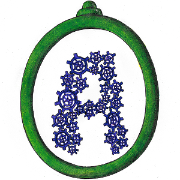

# [Animadio CSS Framework](https://animadio.org)

Grid & Flexbox Layouts - CSS Variables Usage - Reusable & Customizable Elements

Perform Complex Animations - Controls by Radio Buttons - No JavaScript needed

## Summary

Warning, Framework in developement phase :
- [Status](#status)
- [Installation](#installation)
- [Content](#content)
- [Open-Source](#open-source)
- [Community](#community)
- [Documentation](#documentation)
- [Issues & Pull Requests](#issues-&-pull-requests)
- [Contributing](#contributing)
- [Versioning](#versioning)
- [Creator](#creator)
- [Copyright](#copyright)

## Status

> FRAMEWORK IN CONSTRUCTION !
>
> NOT AVAILABLE FOR THE MOMENT !!
>
> ANIMADIO WILL FONCTION VERY SOON !!!

## Installation

**CDN** : 
- unpkg (min) : [https://unpkg.com/animadio/dist/min/animadio.min.css](https://unpkg.com/animadio/dist/min/animadio.min.css)
- jsDelivr (choose the file) : [https://cdn.jsdelivr.net/npm/animadio@latest/dist](https://cdn.jsdelivr.net/npm/animadio@latest/dist)

**Install** :
- NPM : `npm i animadio`
- Yarn : `yarn add animadio`
- Composer : `composer require animadio/animadio`
- Meteor : `meteor add animadio:animadio`
- Pip & Gem : Very Soon !

**Download** :
- [Latest Release](https://github.com/animadio/animadio/releases)
- `git clone https://github.com/animadio/animadio.git`
  
## Content

The dist folder contains :
- `dist/animadio.css`
- `dist/min/animadio.min.css`
- `dist/map/animadio.css.map`

## Open-Source

[GitHub : animadio](https://github.com/animadio)

[CodePen : @animadio](https://codepen.io/animadio)

## Community

[Twitter : @animadio](https://twitter.com/animadio)

[Slack : animadio.slack.com](https://join.slack.com/t/animadio/shared_invite/enQtNTY1NTc5NzgyNDA3LTI2YWIxM2ZkMGM5ODBkNjNjZmI5ZGVlNTM1ZWEwMWI5ZDJjNzViYjNmNWE2MjllMTc3MDhlMzYzZDYzNTkxNjU)

## Documentation

Documentation will arrive as soon as possible !

## Issues & Pull Requests

[Issues can be created here](https://github.com/animadio/animadio/issues)

[And Pull Requests can be create there](https://github.com/animadio/animadio/pulls)

## Contributing

Animadio needs you if you like it : sends pull requests on GitHub to improve it !!

## Versioning

[Animadio is maintained under the Semantic Versioning 2.0.0](https://semver.org)

## Creator

*Philippe Beck* :
- [https://philippebeck.net](https://philippebeck.net)
- [GitHub : philippebeck](https://github.com/philippebeck)
- [Twitter : @philippepjbeck](https://twitter.com/philippepjbeck)

## Copyright

[Code released under the MIT License](https://github.com/animadio/animadio/blob/master/LICENSE)
  